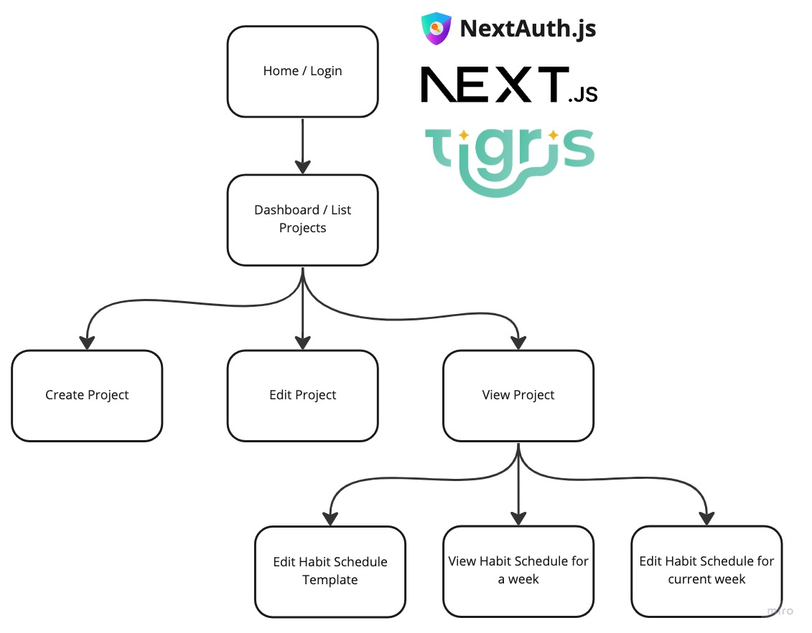

# HabitDabit 🧘

[Habit](https://en.wiktionary.org/wiki/habit)[Dabit](https://en.wiktionary.org/wiki/dabit) is a (Work-in-Progress) application that aims to help people create positive habits through repetition and reward.

It's also a project created to help with my onboarding at [Tigris Data](https://www.tigrisdata.com).

## Tech stack

- [Next.js](https://nextjs.org/) - web framework
- [NextAuth.js](https://next-auth.js.org/) - authentication
- [Tigris](https://www.tigrisdata.com) - database
- [Chakra UI](https://chakra-ui.com/) - accessible React component library

## Development

### Prerequisites

- A [Tigris Cloud](https://www.tigrisdata.com) account
- Install the [Tigris CLI](https://www.tigrisdata.com/docs/sdkstools/cli/installation/)
- [Node.js > 18.13.0](https://nodejs.org/en/download/) installed

### Get the code and install dependencies

```bash
git clone git@github.com:leggetter/habitdabit.git
cd habitdabit
npm install
```

### Create your Tigris Project

Create your Tigris project and Tigris application keys, and set environmental variables.

#### Automated setup

If you're on Mac or Linux, you can start by installing the Tigris CLI:

```bash
brew install tigris
```

And then run:

```bash
npm run create-tigris-project
```

You'll be asked to login to Tigris Cloud during this process, and a `.env.development.local`
will be saved containing your Tigris Project settings.

#### Manual setup

If you'd prefer to create your project and save the project settings to environment variables locally:

1. Login to the [Tigris Console](https://console.preview.tigrisdata.cloud/)
2. Create a Project called `habitdabit` (or some other name if you prefer)
3. Navigate to **Application Keys**
4. Click the eye icon next to the Key with the same name as your Project
5. Create a `.env.development.local` file and copy:

- **URL** to a variable named `TIGRIS_URI`
- **Name** to a variable named `TIGRIS_PROJECT`
- **Client ID** to a variable named `TIGRIS_CLIENT_ID`
- **Client Secret** to a variable named `TIGRIS_CLIENT_SECRET`

6. Finally, add another variable called `TIGRIS_DB_BRANCH` with a value of `develop`

An example `.env.development.local` is in the repo called `.env.development.local.example`.

## Contribute 🙌

Please do get involved! To start off with, we're building a simple MVP:



Take a look at the [issues](https://github.com/leggetter/habitdabit/issues) to see what is planned for HabitDabit or to ask a question.
